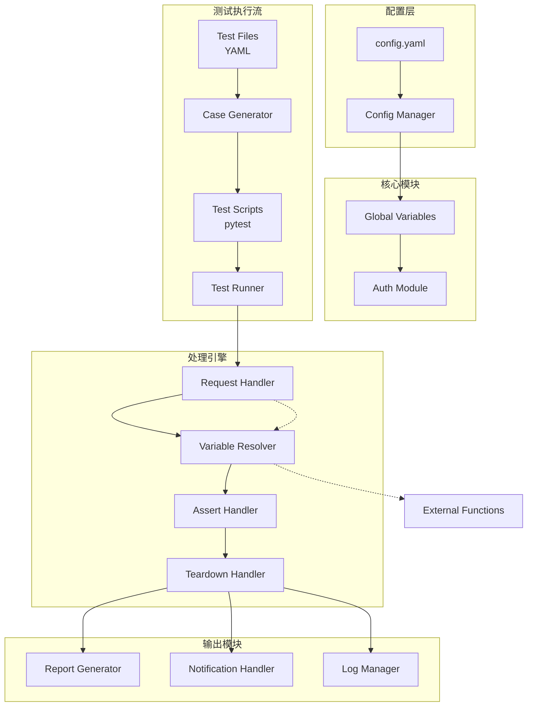

# API Auto Test Framework

<div align="center">


🚀 一个现代化的 API 接口自动化测试框架，支持 YAML 测试用例、MCP Server 集成、Allure 报告

[English](README.md) | 简体中文

</div>

---

> 💡 **为什么需要这个框架？**
>
> 传统 AI 自动测试面临三大核心痛点：**重复代码泛滥**、**Token 浪费严重**、**调试陷入死循环**。每次让 AI 生成测试代码，都要重新传递上下文、重复编写相似的 fixture 和断言，调试一个问题可能消耗数万 Token 还无法解决。本框架通过 YAML 声明式用例 + MCP 集成，让测试代码像文档一样简单，从根本上降低 AI 测试的边际成本。

---

## ✨ 核心特性

| 特性 | 描述 |
|------|------|
| 🧪 **YAML 用例管理** | 使用 YAML 文件定义测试用例，无需编写重复代码 |
| 🤖 **MCP Server 集成** | 与 Claude Code 无缝集成，支持自然语言生成测试用例 |
| 📊 **多格式报告** | 支持 Allure、pytest-html 等多种测试报告 |
| 🔄 **变量解析引擎** | 支持全局变量、步骤间数据传递、外部函数调用 |
| 🔐 **认证管理** | 自动处理 Token 获取和刷新 |
| 📢 **多渠道通知** | 支持钉钉、飞书、企业微信等通知方式 |

---

## 🏗️ 系统架构



---

## 📁 项目结构

```
api-auto-test/
├── atf/                                    # 框架核心代码
│   ├── __init__.py
│   ├── auth.py                             # 认证模块
│   ├── case_generator.py                   # 集成测试用例生成器
│   ├── conftest.py                         # pytest 配置
│   ├── mcp_server.py                       # MCP Server 服务
│   ├── runner.py                           # 测试执行器
│   ├── unit_case_generator.py              # 单元测试用例生成器
│   ├── core/                               # 核心模块
│   │   ├── __init__.py
│   │   ├── assert_handler.py               # 断言处理器
│   │   ├── config_manager.py               # 配置管理器
│   │   ├── globals.py                      # 全局变量管理
│   │   ├── log_manager.py                  # 日志管理器
│   │   ├── login_handler.py                # 登录处理器
│   │   ├── request_handler.py              # HTTP 请求处理器
│   │   └── variable_resolver.py            # 变量解析器
│   ├── handlers/                           # 处理器
│   │   ├── __init__.py
│   │   ├── notification_handler.py         # 通知处理器
│   │   ├── report_generator.py             # 报告生成器
│   │   └── teardown_handler.py             # 后置处理器
│   └── utils/                              # 工具模块
│       ├── __init__.py
│       └── helpers.py                      # 辅助函数
├── tests/                                  # 测试数据目录（YAML 测试用例）
├── docs/                                   # 项目文档
│   ├── mcp_dev_guide.md
│   └── mcp_spec.md
├── config.yaml                             # 配置文件
├── pyproject.toml                          # 项目配置
├── requirements.txt                        # 生产依赖
├── requirements-mcp.txt                    # MCP 服务依赖
└── README.md                               # 项目说明
```

---

## 🚀 快速开始

### 1. 安装依赖

```bash
# 使用 uv（推荐）
uv pip install -r requirements.txt

# 或使用 pip
pip install -r requirements.txt
```

### 2. 配置项目

编辑 `config.yaml`：

```yaml
# 配置文件示例
projects:
  merchant:
    host: "https://api.merchant.example.com"
    env: pre
  nanshan:
    host: "https://api.nanshan.example.com"
    env: online

notification:
  dingtalk:
    webhook: "https://oapi.dingtalk.com/robot/send?access_token=xxx"
    secret: "SECxxx"

database:
  mysql:
    host: "localhost"
    port: 3306
    user: "root"
    password: "password"
    database: "test_db"
```

### 3. 创建测试用例

```yaml
# tests/merchant/demo/test_device_bind.yaml
testcase:
  name: test_device_bind
  description: 测试设备绑定接口
  steps:
    - id: login
      name: 登录获取token
      path: /api/v1/auth/login
      method: POST
      data:
        username: "test_user"
        password: "test_pass"
      assert:
        - type: status_code
          expected: 200
        - type: json_path
          path: $.code
          expected: 0

    - id: bind_device
      name: 绑定设备
      path: /api/v1/devices/bind
      method: POST
      headers:
        Authorization: "{{ login.data.token }}"
      data:
        device_id: "DEV001"
        device_name: "测试设备"
      assert:
        - type: status_code
          expected: 200
        - type: json_path
          path: $.data.device_id
          expected: "DEV001"
```

### 4. 运行测试

```bash
# 运行所有测试
pytest tests/ -v

# 运行指定测试
pytest tests/merchant/demo/test_device_bind.yaml -v

# 生成 Allure 报告
pytest tests/ --alluredir=report/allure
allure serve report/allure
```

---

## 📝 YAML 用例规范

### 集成测试（testcase）

```yaml
testcase:
  name: test_case_name          # 测试用例名称
  description: 测试描述         # 可选，用例描述
  project: project_name         # 项目标识
  steps:                        # 测试步骤列表
    - id: step_id               # 步骤唯一标识
      name: 步骤名称            # 步骤名称
      path: /api/endpoint       # 请求路径
      method: GET               # 请求方法：GET/POST/PUT/DELETE
      headers: {}               # 请求头
      data: {}                  # 请求数据
      params: {}                # URL 参数
      files: {}                 # 文件上传
      assert:                   # 断言列表
        - type: status_code     # 状态码断言
          expected: 200
        - type: json_path      # JSON 路径断言
          path: $.code
          expected: 0
  teardowns:                    # 后置操作（可选）
    - id: cleanup
      name: 清理测试数据
      method: DELETE
      path: /api/devices/DEV001
```

### 单元测试（unittest）

```yaml
unittest:
  name: demo_unittest
  description: 单元测试示例
  env_type: venv              # 虚拟环境类型：venv/conda/uv
  target:
    module: src.service.demo_service  # 被测模块
    class: DemoService        # 被测类（可选）
    function: get_user        # 被测函数（可选）
  fixtures:                   # 测试夹具（可选）
    setup:
      - type: action
        target: instance
        action: create
        value:
          class: DemoService
    teardown:
      - type: action
        target: instance
        action: destroy
  cases:                      # 测试用例列表
    - id: test_get_user
      description: 测试获取用户
      inputs:
        args: [1]             # 函数参数
        kwargs: {}            # 关键字参数
      mocks:                  # Mock 配置（可选）
        - target: requests.get
          return_value:
            json:
              code: 0
              data:
                id: 1
                name: "test_user"
      assert:
        - type: equals
          field: result.name
          expected: "test_user"
        - type: exception
          expected: null
```

### 断言类型

| 类型 | 说明 | 示例 |
|------|------|------|
| `status_code` | HTTP 状态码 | `expected: 200` |
| `json_path` | JSON 路径断言 | `path: $.data.id` |
| `equals` | 精确匹配 | `expected: "value"` |
| `contains` | 包含断言 | `expected: "partial"` |
| `regex` | 正则匹配 | `expected: "^\\d+$"` |
| `length` | 长度断言 | `expected: 5` |
| `exception` | 异常断言 | `expected: null` |

---

## 🔧 变量表达式

框架支持丰富的变量表达式，用于数据传递和动态计算：

```yaml
# 全局变量引用
Authorization: "{{ merchant.token }}"

# 步骤间数据传递
device_id: "{{ bind_device.data.device_id }}"

# 外部函数调用
timestamp: "{{ tools.get_timestamp() }}"
random_str: "{{ tools.generate_uuid() }}"

# 字符串拼接
full_url: "{{ base_url }}{{ step1.data.path }}"
```

---

## 🤖 MCP Server 集成

### 1️⃣ 安装 uv（必需）

uv 是新一代 Python 包管理器，用于安装和运行 MCP 服务器。

**macOS / Linux：**
```bash
curl -LsSf https://astral.sh/uv/install.sh | sh
```

**Windows（PowerShell）：**
```powershell
powershell -ExecutionPolicy ByPass -c "irm https://astral.sh/uv/install.ps1 | iex"
```

**验证安装：**
```bash
uv --version
```

### 2️⃣ 安装 MCP 服务器

**方式一：uv tool install（推荐）**
```bash
uv tool install git+https://github.com/GalaxyXieyu/Api-Test-MCP.git
```

**方式二：pipx 安装**
```bash
# 确保已安装 pipx
pipx install git+https://github.com/GalaxyXieyu/Api-Test-MCP.git
```

**方式三：本地开发模式**
```bash
cd /path/to/api-auto-test
uv run mcp install atf/mcp_server.py --name "api-auto-test"
```

### 3️⃣ 配置到编辑器

安装完成后，需要将 MCP 服务器配置到你的编辑器中。复制以下 JSON 配置到对应编辑器的 MCP 设置中：

```json
{
  "mcpServers": {
    "api-auto-test-mcp": {
      "command": "api-auto-test-mcp",
      "args": ["--workspace", "${workspace}"]
    }
  }
}
```

**各编辑器配置方法：**

| 编辑器 | 配置位置 | 操作 |
|--------|---------|------|
| **Claude Code** | `~/.claude/.mcp.json` | 直接运行 `api-auto-test-mcp install` 自动配置 |
| **Cursor** | `~/.cursor/settings.json` 或 MCP 设置界面 | 手动添加上方 JSON |
| **Continue (VSCode)** | `.vscode/mcp.json` | 在项目根目录创建文件 |
| **Windsurf** | MCP 设置界面 | 手动添加上方 JSON |
| **其他 MCP 客户端** | 对应设置页面 | 手动添加上方 JSON |

**手动配置示例（Cursor）：**
1. 打开 Cursor 设置
2. 搜索 "MCP" 或 "Model Context Protocol"
3. 点击 "Edit MCP Servers" 或添加新配置
4. 粘贴上方 JSON 配置

**Continue (VSCode) 项目级配置：**
```json
// .vscode/mcp.json
{
  "mcpServers": {
    "api-auto-test-mcp": {
      "command": "api-auto-test-mcp",
      "args": ["--workspace", "${workspace}"]
    }
  }
}
```

### 4️⃣ 验证安装

```bash
# 检查命令是否可用
api-auto-test-mcp --help

# 应该看到输出：
# Usage: api-auto-test-mcp [OPTIONS] COMMAND [ARGS]...
```

### 5️⃣ 重启编辑器

配置完成后，**重启编辑器**即可使用 MCP 工具。

### MCP 工具

| 工具 | 说明 |
|------|------|
| `write_testcase` | 创建集成测试用例 |
| `write_unittest` | 创建单元测试用例 |
| `list_testcases` | 列出所有测试用例 |
| `read_testcase` | 读取测试用例详情 |
| `regenerate_py` | 重新生成测试脚本 |
| `validate_testcase` | 校验测试用例格式 |
| `delete_testcase` | 删除测试用例 |

### 使用示例

```
# 告诉 Claude：
"创建一个测试用户登录接口的测试用例"

# Claude 会自动生成 YAML 文件和 pytest 脚本
```

---

## 📊 测试报告

### Allure 报告

```bash
# 生成报告
pytest tests/ --alluredir=report/allure

# 本地预览
allure serve report/allure

# 生成 HTML
allure generate report/allure -o report/html
```

### 通知配置

```yaml
notification:
  dingtalk:
    webhook: "https://oapi.dingtalk.com/robot/send?access_token=xxx"
    secret: "SECxxx"              # 钉钉加签密钥
  feishu:
    webhook: "https://open.feishu.cn/open-apis/bot/v2/hook/xxx"
  wechat:
    webhook: "https://qyapi.weixin.qq.com/cgi-bin/webhook/send?key=xxx"
```

---

## 📖 最佳实践

### 1. 项目组织

```
tests/
├── api/                      # API 接口测试
│   ├── user/
│   │   ├── test_user_login.yaml
│   │   ├── test_user_register.yaml
│   │   └── test_user_profile.yaml
│   └── order/
│       ├── test_order_create.yaml
│       └── test_order_cancel.yaml
├── unit/                     # 单元测试
│   ├── test_user_service.yaml
│   └── test_order_service.yaml
└── integration/              # 集成测试
    └── test_business_flow.yaml
```

### 2. 环境管理

```bash
# 测试环境
pytest tests/ -v --env=test

# 预发环境
pytest tests/ -v --env=pre

# 生产环境
pytest tests/ -v --env=online
```

### 3. 持续集成

```yaml
# .github/workflows/test.yml
name: API Tests

on: [push, pull_request]

jobs:
  test:
    runs-on: ubuntu-latest
    steps:
      - uses: actions/checkout@v3
      - name: Set up Python
        uses: actions/setup-python@v4
        with:
          python-version: '3.10'
      - name: Install dependencies
        run: |
          pip install -r requirements.txt
      - name: Run tests
        run: |
          pytest tests/ --alluredir=report/allure
      - name: Upload report
        uses: actions/upload-artifact@v3
        with:
          name: allure-report
          path: report/allure
```

---

## 🤝 贡献指南

1. Fork 本仓库
2. 创建特性分支 (`git checkout -b feature/amazing-feature`)
3. 提交更改 (`git commit -m 'feat: add amazing feature'`)
4. 推送到分支 (`git push origin feature/amazing-feature`)
5. 开启 Pull Request

---

## 📄 许可证

本项目采用 MIT 许可证 - 详见 [LICENSE](LICENSE) 文件

---

## 📞 联系方式

- **作者**: Galaxy Xie
- **GitHub**: [api-auto-test](https://github.com/galaxyxieyu/api-auto-test)
- **问题反馈**: [Issues](https://github.com/galaxyxieyu/api-auto-test/issues)

---

<div align="center">

⭐ 如果本项目对你有帮助，欢迎 Star 支持！

</div>
