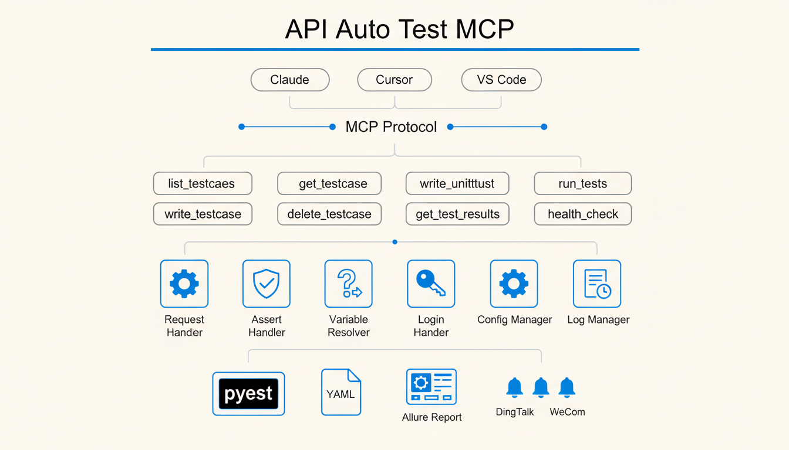

<div align="center">
  
</div>

# API Auto Test Framework


**YAML 声明式 API 测试框架，专为 AI 编程助手优化**

[快速开始](#快速开始) | [MCP 集成](#mcp-server-集成) | [YAML 规范](#yaml-用例规范) | [单元测试](#单元测试)

---

## 为什么需要这个框架

让 AI 写接口测试代码，你可能遇到过这些问题：

**场景 1：重复劳动**

每次让 AI 生成测试，都要重新描述项目结构、认证方式、断言风格。测试 10 个接口，同样的 fixture 和 setup 代码生成了 10 遍。

**场景 2：Token 黑洞**

一个简单的登录接口测试，AI 生成了 200 行代码。你发现断言写错了，让它改，又生成 200 行。改 3 次，消耗 2000+ Token，最后还是你自己手动改的。

**场景 3：调试死循环**

AI 生成的测试跑不通，报错信息贴给它，它改了一版还是不对。来回复 5 轮对话，问题还在，Token 已经烧了 5000+。

**这个框架的解决方案：**

```
传统方式：自然语言描述 -> AI 生成完整代码 -> 运行报错 -> 贴报错 -> AI 重新生成 -> 循环...
本框架：  自然语言描述 -> AI 生成 YAML    -> 框架执行 -> 直接定位问题 -> 改 YAML 一行
```

| 对比项 | 传统 AI 生成 | 本框架 |
|--------|-------------|--------|
| 测试 1 个接口 | ~200 行代码 | ~20 行 YAML |
| 修改断言逻辑 | 重新生成全部代码 | 改 1-2 行 YAML |
| 10 个接口测试 | 重复 setup 10 次 | 共享配置，0 重复 |
| 调试一个问题 | 平均 3-5 轮对话 | 通常 1 轮 |

---

## 核心特性

| 特性 | 说明 |
|------|------|
| **YAML 声明式用例** | 测试逻辑与执行代码分离，AI 只需生成结构化数据 |
| **MCP Server** | 与 Claude/Cursor 等 AI 编辑器无缝集成 |
| **接口 Workflow 编排** | 单文件支持多步骤接口调用，步骤间数据传递与断言 |
| **变量解析引擎** | 支持步骤间数据传递、全局变量、动态函数调用 |
| **自动认证管理** | Token 获取和刷新由框架处理 |
| **数据工厂** | 无需 Java 依赖，内置 Mock 数据生成 |
| **多格式测试报告** | Allure（离线/在线）、pytest-html（独立 HTML，美化样式） |
| **多渠道通知** | 钉钉、飞书、企业微信 |
| **单元测试** | 支持 Python 代码单元测试，Mock 依赖自动注入 |

---

## 快速开始

### 安装

```bash
# 1. 安装 uv（如果没有）
curl -LsSf https://astral.sh/uv/install.sh | sh

# 2. 安装 MCP 服务器（推荐：安装为 tool）
uv tool install git+https://github.com/GalaxyXieyu/Api-Test-MCP.git

# 验证
api-auto-test-mcp --help

# 管理工具
uv tool list
uv tool uninstall api-auto-test   # 以 `uv tool list` 展示的 tool 名称为准
```

**无需安装，直接运行（uvx）：**

```bash
uvx --from git+https://github.com/GalaxyXieyu/Api-Test-MCP.git api-auto-test-mcp --help
```

**常见误用：** `uvx install ...` 是 **错误** 用法。`uvx` 会把后面的第一个词当成“工具名”，于是会去解析一个叫 `install` 的包，进而报 “install not found”。

### 配置编辑器

将以下配置添加到编辑器的 MCP 设置：

```json
{
  "mcpServers": {
    "api-auto-test": {
      "command": "api-auto-test-mcp"
    }
  }
}
```

| 编辑器 | 配置位置 |
|--------|---------|
| Claude Desktop | `~/Library/Application Support/Claude/claude_desktop_config.json` |
| Cursor | 设置 -> MCP Servers |
| VSCode + Continue | `.vscode/mcp.json` |

### 源码测试开发

```bash
# 推荐使用 uv
uv pip install -r requirements.txt

# 或 pip
pip install -r requirements.txt
```

### 创建测试用例

```yaml
# tests/cases/user_login.yaml
testcase:
  name: user_login
  description: 用户登录接口测试
  host: http://localhost:8000
  steps:
    - id: login
      path: /api/auth/login
      method: POST
      data:
        username: "test_user"
        password: "123456"
      assert:
        - type: status_code
          expected: 200
        - type: equals
          field: data.code
          expected: 0
```

### 生成并运行

```bash
# 生成 pytest 脚本
python -m atf.case_generator

# 运行测试
pytest tests/scripts/ -v

# 生成 Allure 报告
pytest tests/scripts/ --alluredir=tests/allure-results
allure serve tests/allure-results

# 生成 pytest-html 报告
pytest tests/scripts/ --html=report.html
```

---

## MCP Server 集成

通过 MCP，AI 编辑器可以直接调用框架工具生成和执行测试。

### 效率对比分析

| 指标 | 不使用 MCP | 使用 MCP | 差异 |
|------|-----------|----------|------|
| 总成本 | $0.0214 | $0.0099 | **-54%** |
| API 耗时 | 11 秒 | 4 秒 | **-64%** |
| 输出 Token 数 | 585 | 238 | **-59%** |
| 缓存读取 | 42.0k | 21.0k | **-50%** |

**测试场景**：相同的接口测试生成任务（纯咨询/分析类对话）

**核心优势**：
- **成本降低 54%**：MCP 直接调用工具，避免冗长的代码生成上下文
- **API 响应快 64%**：工具化调用比自然语言交互更高效
- **Token 消耗减少 59%**：只需传递必要参数，无需重复描述项目结构

### 可用工具

| 工具 | 说明 |
|------|------|
| `list_testcases` | 列出测试用例 |
| `get_testcase` | 读取用例内容 |
| `write_testcase` | 创建/更新用例并生成 pytest 脚本 |
| `write_unittest` | 创建单元测试 |
| `delete_testcase` | 删除用例 |
| `run_tests` | 执行测试 |
| `get_test_results` | 获取测试执行历史 |
| `health_check` | 服务健康检查 |

### 使用示例

对 AI 说：

```
帮我创建一个测试 /api/users 接口的用例，验证返回的用户列表长度大于 0
```

AI 会调用 `write_testcase` 生成 YAML 和对应的 pytest 脚本。

---

## 项目结构

```
api-auto-test/
├── atf/                    # 框架核心
│   ├── core/               # 请求、断言、变量解析等核心模块
│   ├── mcp/                # MCP Server 实现
│   └── handlers/           # 通知、报告等处理器
├── tests/
│   ├── cases/              # YAML 测试用例
│   └── scripts/            # 生成的 pytest 脚本
├── config.yaml             # 项目配置（环境、数据库、通知）
└── pyproject.toml
```

---

## YAML 用例规范

### 基本结构

```yaml
testcase:
  name: test_name              # 用例名称，用于生成文件名
  description: 描述            # 可选
  host: http://localhost:8000  # API 地址，也可在 config.yaml 全局配置
  steps:
    - id: step1                # 步骤 ID，用于后续引用
      path: /api/endpoint
      method: POST
      headers:
        Authorization: "Bearer {{ login.data.token }}"  # 引用其他步骤的响应
      data:
        key: value
      assert:
        - type: status_code
          expected: 200
        - type: equals
          field: data.id
          expected: 1
```

### 断言类型

| 类型 | 说明 | 示例 |
|------|------|------|
| `status_code` | HTTP 状态码 | `expected: 200` |
| `equals` | 精确匹配 | `field: data.id, expected: 1` |
| `contains` | 包含 | `field: data.name, expected: "test"` |
| `length` | 数组/字符串长度 | `field: data.list, expected: 10` |
| `regex` | 正则匹配 | `field: data.email, expected: "^\\w+@"` |

### 变量引用

```yaml
# 引用其他步骤的响应数据
token: "{{ login.data.token }}"

# 引用全局配置
host: "{{ merchant.host }}"

# 调用内置函数
timestamp: "{{ tools.get_timestamp() }}"
uuid: "{{ tools.generate_uuid() }}"
```

### 后置清理

```yaml
testcase:
  name: create_and_delete_user
  steps:
    - id: create_user
      path: /api/users
      method: POST
      data:
        name: "test_user"
  teardowns:
    - id: delete_user
      operation_type: api
      path: /api/users/{{ create_user.data.id }}
      method: DELETE
```

---

## 单元测试

支持为 Python 代码编写单元测试，通过 MCP 工具自动生成测试用例。

### 单元测试 YAML 格式

```yaml
unittest:
  name: UserService 测试
  target:
    module: app.services.user_service
    class: UserService
    function: get_user
  fixtures:
    setup:
      - type: patch
        target: app.services.user_service.UserRepository
        return_value:
          id: 1
          name: "test_user"
  cases:
    - id: test_get_user_success
      description: 测试获取用户成功
      inputs:
        args: [1]
        kwargs: {}
      assert:
        - type: equals
          field: result.id
          expected: 1
        - type: equals
          field: result.name
          expected: "test_user"
```

### 断言类型

| 类型 | 说明 |
|------|------|
| `equals` | 精确匹配 |
| `not_equals` | 不匹配 |
| `contains` | 包含 |
| `raises` | 期望抛出异常 |
| `is_none` | 结果为 None |
| `is_not_none` | 结果不为 None |
| `called_once` | mock 被调用一次 |
| `called_with` | mock 被特定参数调用 |

---

## 配置文件

```yaml
# config.yaml
projects:
  merchant:
    test:
      host: http://192.168.1.100:8080
      is_need_login: true
      login:
        url: http://192.168.1.100:8080/login
        method: POST
        data:
          username: admin
          password: "123456"
    online:
      host: https://api.example.com
      is_need_login: true

notifications:
  dingtalk:
    webhook: "https://oapi.dingtalk.com/robot/send?access_token=xxx"
    secret: "SECxxx"
```

---

## 许可证

MIT License

---

## 链接

- [GitHub](https://github.com/GalaxyXieyu/Api-Test-MCP)
- [问题反馈](https://github.com/GalaxyXieyu/Api-Test-MCP/issues)

